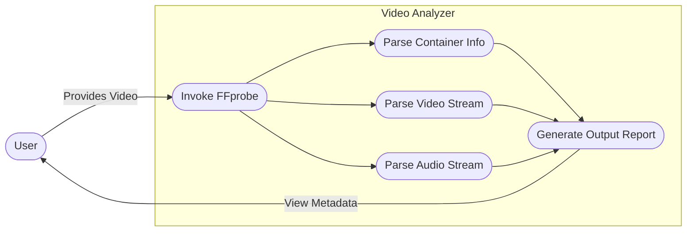

# Lab 3: Video Analyzer

This script reads a video file and generates a metadata report using `ffprobe` (part of the FFmpeg suite). It extracts details about the container, the video stream (resolution, frame rate, codec), and the audio stream (channels, sample rate, codec).

## Usage
```bash
python video_analyzer.py <path_to_video>
```

## Requirements
- Python 3
- FFmpeg/ffprobe installed on the system and available in the system path.

## System Workflow / Use Case

