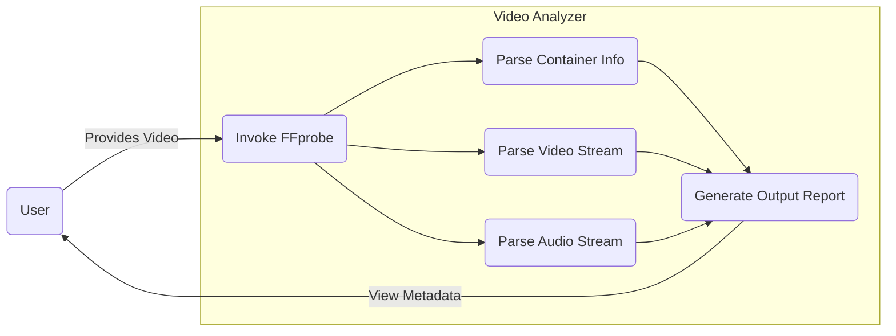

# Lab 3: Video Analyzer

This script reads a video file and generates a metadata report using `ffprobe` (part of the FFmpeg suite). It extracts details about the container, the video stream (resolution, frame rate, codec), and the audio stream (channels, sample rate, codec).

## Usage
```bash
python video_analyzer.py <path_to_video>
```

## Requirements
- Python 3
- FFmpeg/ffprobe installed on the system and available in the system path.

## System Workflow / Use Case


## Sample Output
```text
================================
VIDEO METADATA REPORT
================================
File Name       : proper_video.mp4
File Size       : 0.75 MB
Container       : QuickTime / MOV
Duration        : 10.03 seconds

VIDEO
--------------------------------
Resolution      : 320x176
Frame Rate      : 25/1
Bit Rate        : 300 kbps
Codec           : h264

AUDIO
--------------------------------
Codec           : aac
Channels        : 2
Sampling Rate   : 48000 Hz
Bit Rate        : 160 kbps

METADATA
--------------------------------
major_brand     : mp42
minor_version   : 0
compatible_brands : mp42isomavc1
creation_time   : 2012-03-13T08:58:06.000000Z
encoder         : HandBrake 0.9.6 2012022800
```
