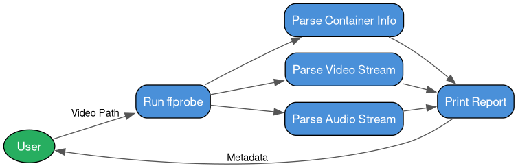

# Lab 3 — Video Analyzer

Reads a video file using `ffprobe` (FFmpeg) and reports container info, video stream (resolution, FPS, codec), audio stream (channels, sample rate, codec), and embedded metadata tags.

## Usage
```bash
python video_analyzer.py <path_to_video>
```

## Requirements
- FFmpeg installed (`sudo pacman -S ffmpeg` on Arch)

## Sample File Used

▶️ [sample.mp4](sample.mp4) — Big Buck Bunny clip (771 KB, H.264/AAC)

## Workflow



## Sample Output
```
================================
VIDEO METADATA REPORT
================================
File Name       : sample.mp4
File Size       : 0.75 MB
Container       : QuickTime / MOV
Duration        : 10.03 seconds

VIDEO
--------------------------------
Resolution      : 320x176
Frame Rate      : 25/1
Bit Rate        : 300 kbps
Codec           : h264

AUDIO
--------------------------------
Codec           : aac
Channels        : 2
Sampling Rate   : 48000 Hz
Bit Rate        : 160 kbps

METADATA
--------------------------------
major_brand     : mp42
minor_version   : 0
compatible_brands : mp42isomavc1
creation_time   : 2012-03-13T08:58:06.000000Z
encoder         : HandBrake 0.9.6 2012022800
```
